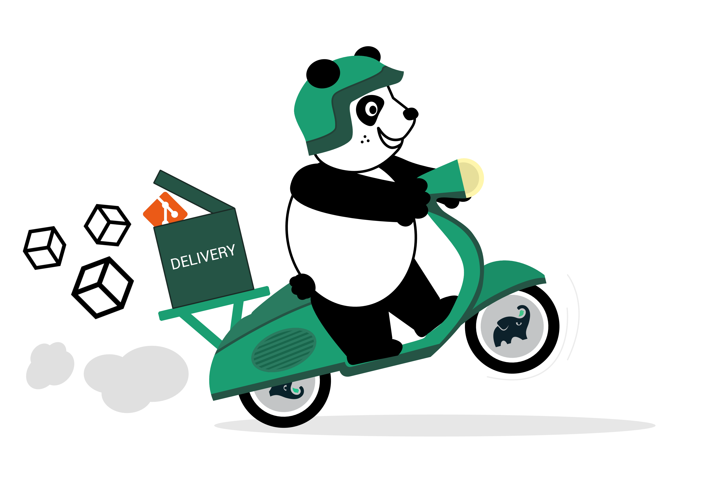
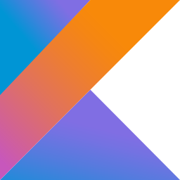
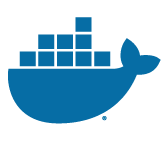

:javaVersion: 1+
:kotlinVersion: 1+
:groovyVersion: 1+
:androidVersion: 2+
:iOSVersion: 8+
:ionicVersion: 3+
:reactVersion: 1+
:dockerVersion: 1+
:flutterVersion: Beta 1+

= Delivery

:htmlPath:
ifdef::env-github[:htmlPath: http://mobiletribe.github.io/delivery-gradle-plugin/]

image:https://api.bintray.com/packages/mobiletribe/maven/com.leroymerlin.plugins:delivery-plugin/images/download.svg[link="https://bintray.com/mobiletribe/maven/com.leroymerlin.plugins:delivery-plugin/_latestVersion"]
image:http://img.shields.io/badge/license-ASF2-blue.svg?style=flat-square["Apache License 2", link="http://www.apache.org/licenses/LICENSE-2.0.txt"]
{zwsp} +
{zwsp} +
image:https://img.shields.io/badge/Java-1+-green.svg?style=flat-square["Java", link=""]
image:https://img.shields.io/badge/Kotlin-1+-green.svg?style=flat-square["Kotlin", link=""]
image:https://img.shields.io/badge/Groovy-1+-green.svg?style=flat-square["Groovy", link=""]
image:https://img.shields.io/badge/Android-2+-green.svg?style=flat-square["Android", link=""]
image:https://img.shields.io/badge/iOS-8+-yellow.svg?style=flat-square["iOS", link=""]
image:https://img.shields.io/badge/Ionic-3+-yellow.svg?style=flat-square["Ionic", link=""]
image:https://img.shields.io/badge/React_Native-1+-green.svg?style=flat-square["React", link=""]
image:https://img.shields.io/badge/Flutter-Beta_1+-green.svg?style=flat-square["Flutter", link=""]
image:https://img.shields.io/badge/Docker-1+-green.svg?style=flat-square["Docker", link=""]


_Make your continuous delivery faster and easier_

== Note

Delivery is the gradle plugin you need, to simplify your project industrialization.

It's *easy to use*. Don't waste your time installing many tools. *Adjust it* to your needs. Handle *any type* of project.

This plugin supports natively Java, Groovy, Kotlin, Android, Android library, iOS, Ionic and React Native projects, but you can easily extend the support to any project type.

Delivery handles the following parts of your continuous delivery process :

- powerful workflow
- simply build and sign artifacts
- archive all you need into space

This plugin is based on 2 other plugins :

- https://docs.gradle.org/current/userguide/maven_plugin.html[Maven plugin]
- https://github.com/openbakery/gradle-xcodePlugin[gradle-xcodePlugin] from openbakery

*Delivery use Maven naming convention to archive*

== Configuration

To use delivery, you just have to apply the plugin in your project.

```Groovy
buildscript {
	repositories {
		jcenter()
	}

	dependencies {
		classpath 'com.leroymerlin.plugins:delivery-plugin:LAST_VERSION'
	}
}

apply plugin: 'com.leroymerlin.delivery'
```
and then configure it by following the link:{htmlPath}delivery-doc/html/Tutorial.html[Tutorial]

== Compatibility

:size: 60
[cols="12*^.^"]
|=======
2+^e|Platform | | |image:./delivery-doc/assets/logos/groovy.png["Groovy", {size}] | | | | |image:./delivery-doc/assets/logos/flutter.png["Flutter", {size}] | |
2+^e|Version |{javaVersion}|{kotlinVersion}|{groovyVersion}|{androidVersion}|{iOSVersion}|{ionicVersion}|{reactVersion}|{flutterVersion}|{dockerVersion}|And more
|=======

_All product names, logos, and brands are property of their respective owners. All company, product and service names used are for identification purposes only. Use of these names, logos, and brands does not imply endorsement._

== How it works


== Changelog - link:{htmlPath}delivery-doc/html/Changelog.html[Full changelog]


=== *3.3.1* - (2019-04-30)
- Fix : crash on sdk 11+
- Fix : Git credential in env ignored

=== *3.3.0* - (2018-11-08)
- ReactNative : refactor react native configurator
- Flutter : refactor flutter configurator
- Debug : link listArtifacts and listDockerImages tasks to linked sub module

=== *3.2.3* - (2018-10-04)
- Install : fix install task dependencies on java project

=== *3.2.2* - (2018-10-03)
- Group: Fix default group on android and ionic

=== *3.2.1* - (2018-10-03)
- Logs: fix format
- Logger: add handler only if there is not a handler already added
- ReleaseGitFLow: fix commit message
- Docker: fix the way to get the registry name

=== *3.2.0* - (2018-09-28)
- Add Docker compatibility
- Multiple fixes

=== *3.1.2* - (2018-07-17)
- Fix multi module feature

=== *3.1.1* - (2018-07-11)
- Change group arg from GROUP to GROUP_ID
- Unlock Apple keychain before ios builds

=== *3.1.0* - (2018-05-31)
- Add Flutter compatibility
- Check OS and platforms before builds
- Add color for logs
- Show more precise logs
- Add task to list all artifacts
- Use group system property if set for Android build

== Get Started - link:{htmlPath}delivery-doc/html/Tutorial.html[Tutorial]

To learn how to use the plugin, please read link:{htmlPath}delivery-doc/html/Tutorial.html[tutorial part] of this wiki.

Please remember that Delivery is an *open source* project.
Do not hesitate to participate by sharing your questions, bug fixes or improvements.

== Partner

image:./delivery-doc/assets/partner/lm.jpg[Leroy Merlin,120,120]

== License

Licensed under the Apache License, Version 2.0 (the "License");
you may not use this file except in compliance with the License.
You may obtain a copy of the License at

   http://www.apache.org/licenses/LICENSE-2.0

Unless required by applicable law or agreed to in writing, software
distributed under the License is distributed on an "AS IS" BASIS,
WITHOUT WARRANTIES OR CONDITIONS OF ANY KIND, either express or implied.
See the License for the specific language governing permissions and
limitations under the License.
